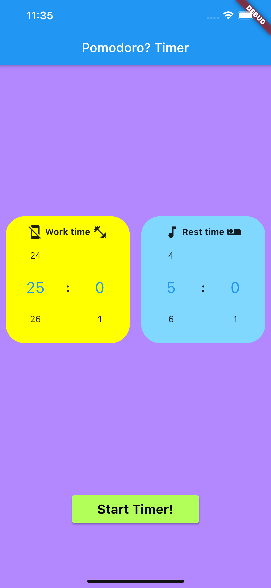

# Pomodoro Timer

このリポジトリは Code Chrysalisの生徒であるときに作成しました。
This was created during our time as a student at Code Chrysalis.

## How to use this app/ 使い方

This is the main page of this app. You can set the work time and rest time. Default time is set as Pomodoro Timer that is 25/5 min period.
After setting the time, press start button at the bottom and the timer starts! Enjoy your time!

これがアプリのメインページです。集中したい時間と休憩したい時間を選択することができます。デフォルトではポモドーロタイマーと同じ25/5分周期に設定しています。
時間を決めたら画面下にあるstartボタンを押すことでタイマーが始まります!

